# Dijon Événements — API REST Backend


Backend REST API for Dijon Événements — a mobile application that aggregates real cultural events from the Dijon/Burgundy region using the OpenAgenda API. Built with Spring Boot and Kotlin, containerised with Docker Compose.

---

## Demo

📱 [Download APK for Android](https://github.com/AdrianMalmierca/frontend-evenements-dijon-api/releases/latest)

**Advice:** The backend runs on Render so it takes around 60 seconds to start and after 15 minutes of inactivity it sleeps again, so it is normal if the first login or register takes time.

> Enable **Unknown sources** in Settings → Security before installing.

---

## Live Architecture

```
Android App (Kotlin)
        │
        ▼
Spring Boot API  ──────►  OpenAgenda API (events)
        │                         │
        ▼                         ▼
  PostgreSQL              Caffeine Cache (10 min TTL)
  (users, favourites,
   FCM tokens)
        │
        ▼
  Firebase Admin SDK ──► FCM ──► Push Notifications
```

### Architecture



> See also: [frontend-evenements-dijon-api](https://github.com/AdrianMalmierca/frontend-evenements-dijon-api) — the native Android client for this API.

---

## Problem Statement

Cultural venues and municipalities in the Dijon area publish their events across fragmented platforms. OpenAgenda aggregates them, but their API is not designed for direct mobile consumption — it requires proxying, authentication, and personalisation (favourites, user accounts).

This backend solves that by:
- Acting as a secure proxy to OpenAgenda, exposing a clean REST API for the mobile app
- Adding user authentication with JWT so each user has their own session
- Persisting favourited events per user in PostgreSQL
- Providing a keyword search endpoint that filters events from the Dijon agenda
- Sending push notifications via Firebase when users add a favourite event

---

## Features

### Authentication
- Register and login with email and password
- Passwords hashed with BCrypt
- Stateless JWT authentication — no server-side sessions
- Protected endpoints via Spring Security filter chain

### Events
- Fetch real events from the Dijon Métropole OpenAgenda feed
- Pagination support (`page` and `size` parameters)
- Keyword search across event titles and descriptions
- Events include title, description, image URL, location, GPS coordinates, dates, and categories
- Public endpoint — no authentication required to browse events
- Responses cached with Caffeine (10 min TTL) to reduce external API calls

### Favourites
- Authenticated users can save and remove favourite events
- Favourites persisted in PostgreSQL
- Push notification sent via Firebase when a favourite is added

### Push Notifications
- Firebase Admin SDK integration
- FCM token stored per user after login
- Notification sent on favourite added: *«Event name» a été ajouté à vos favoris*

### Security & Performance
- Rate limiting: 60 requests per minute per IP via Bucket4j (returns 429 on excess)
- Input validation via `@Valid` constraints on all request bodies
- Stateless JWT — no server sessions

---

## Tech Stack

| Layer | Technology | Reason |
|-------|-----------|--------|
| Framework | Spring Boot 3.2.5 | Production-grade Java/Kotlin backend, standard in French ESNs |
| Language | Kotlin | Concise, null-safe, idiomatic JVM |
| Security | Spring Security + JWT (jjwt) | Industry-standard stateless auth |
| Database | PostgreSQL 16 | Reliable relational DB, widely used in production |
| ORM | Spring Data JPA + Hibernate | Type-safe queries, auto DDL |
| HTTP Client | WebFlux WebClient | Non-blocking calls to OpenAgenda API |
| Caching | Caffeine | In-memory cache with TTL, reduces OpenAgenda API calls |
| Rate Limiting | Bucket4j | Token bucket algorithm, protects against abuse |
| Push Notifications | Firebase Admin SDK | FCM push notifications to Android app |
| Containerisation | Docker Compose | One-command local setup, production-ready |
| Build | Gradle (Kotlin DSL) | Modern build tooling for Kotlin projects |
| CI | GitHub Actions | Automated build and test on every push |

---

## Project Structure

```
dijon-events-backend/
├── src/main/kotlin/com/adrianmalmierca/dijonevents/
│   ├── DijonEventsApplication.kt           # Entry point (@EnableCaching)
│   ├── client/
│   │   └── OpenAgendaClient.kt             # WebClient integration with OpenAgenda API
│   ├── config/
│   │   ├── FirebaseConfig.kt               # Firebase Admin SDK initialisation
│   │   ├── JwtAuthFilter.kt                # JWT validation filter
│   │   ├── JwtUtil.kt                      # Token generation and validation
│   │   ├── RateLimitFilter.kt              # Bucket4j rate limiting (60 req/min/IP)
│   │   ├── SecurityConfig.kt               # Spring Security filter chain
│   │   └── WebClientConfig.kt              # WebClient bean configuration
│   ├── controller/
│   │   ├── AuthController.kt               # POST /api/auth/register, /api/auth/login
│   │   └── EventController.kt              # GET /api/events, /api/events/favorites, FCM token
│   ├── dto/
│   │   └── Dtos.kt                         # Request/response DTOs + OpenAgenda models
│   ├── model/
│   │   ├── User.kt                         # User entity (includes fcmToken field)
│   │   └── FavoriteEvent.kt                # Favourite event entity
│   ├── repository/
│   │   ├── UserRepository.kt
│   │   └── FavoriteEventRepository.kt
│   └── service/
│       ├── AuthService.kt                  # Register and login logic
│       ├── EventService.kt                 # Event fetching, caching, favourite management
│       ├── NotificationService.kt          # Firebase FCM push notification sender
│       └── UserDetailsServiceImpl.kt       # Spring Security UserDetailsService
├── src/main/resources/
│   └── application.yml                     # App configuration (env-based, Caffeine cache)
├── src/test/kotlin/com/adrianmalmierca/dijonevents/
│   ├── AuthControllerIntegrationTest.kt    # Register, login, wrong password tests
│   └── EventControllerIntegrationTest.kt   # Events endpoint + auth tests
├── .github/workflows/
│   └── ci.yml                              # GitHub Actions — build and test
├── Dockerfile                              # Multi-stage build (Gradle → JRE Alpine)
├── docker-compose.yml                      # Backend + PostgreSQL services
├── .env.example                            # Environment variables template
└── build.gradle.kts                        # Gradle build configuration
```

---

## Running Locally

### Prerequisites
- Docker Desktop
- Java 21 (only needed if running outside Docker)
- A Firebase project with a service account key (for push notifications)

```bash
# Clone the repository
git clone https://github.com/AdrianMalmierca/evenements-dijon-api
cd evenements-dijon-api

# Set up environment variables
cp .env.example .env
# Fill in OPENAGENDA_API_KEY, OPENAGENDA_DIJON_UID, and JWT_SECRET
```

### Getting your OpenAgenda credentials

1. Register at [openagenda.com](https://openagenda.com/signin) — free account
2. Go to your profile settings and copy your **API Key**
3. Navigate to [openagenda.com/dijon-metropole](https://openagenda.com/dijon-metropole), find the agenda **UID** in the sidebar
4. Add both values to your `.env`

### Getting your Firebase credentials (optional — for push notifications)

1. Go to [console.firebase.google.com](https://console.firebase.google.com)
2. Select your project → Settings (⚙️) → **Service accounts**
3. Click **Generate new private key** — a `.json` file downloads
4. Save it as `firebase-service-account.json` in the project root
5. The backend starts without it — push notifications are simply disabled if the file is missing

```bash
# Start the backend and PostgreSQL with a single command
docker compose up --build
```

The API will be available at `http://localhost:8080`.

### Environment Variables

```env
DB_USERNAME=dijon
DB_PASSWORD=dijon
JWT_SECRET=your-secret-min-32-chars   # openssl rand -base64 32
OPENAGENDA_API_KEY=your_api_key
OPENAGENDA_DIJON_UID=your_agenda_uid
```

---

## API Reference

### Authentication

| Method | Endpoint | Auth | Description |
|--------|----------|------|-------------|
| POST | `/api/auth/register` | Public | Create a new user account |
| POST | `/api/auth/login` | Public | Sign in and receive JWT token |

**Register / Login request body:**
```json
{
  "name": "Adrián",
  "email": "adrian@example.com",
  "password": "123456"
}
```

**Response:**
```json
{
  "token": "eyJhbGciOiJIUzI1NiJ9...",
  "email": "adrian@example.com",
  "name": "Adrián"
}
```

### Events

| Method | Endpoint | Auth | Description |
|--------|----------|------|-------------|
| GET | `/api/events` | Public | List events (paginated) |
| GET | `/api/events?keyword=jazz` | Public | Search events by keyword |
| GET | `/api/events?page=1&size=20` | Public | Paginated events |
| GET | `/api/events/favorites` | Bearer token | Get current user's favourites |
| POST | `/api/events/favorites` | Bearer token | Add event to favourites (triggers push notification) |
| DELETE | `/api/events/favorites/{uid}` | Bearer token | Remove event from favourites |
| POST | `/api/events/fcm-token` | Bearer token | Register device FCM token |

**Paginated event response:**
```json
{
  "events": [...],
  "total": 154,
  "page": 0,
  "size": 20,
  "hasMore": true
}
```

**Single event example:**
```json
{
  "uid": "8853045",
  "title": "La Pépite #8, The 113",
  "description": "Concert, Post-punk",
  "imageUrl": "https://cdn.openagenda.com/main/f514585b4d044e77b589466addb40c63.base.image.jpg",
  "locationName": "La Vapeur",
  "address": "42 avenue de Stalingrad 21000 Dijon",
  "city": "Dijon",
  "latitude": 47.345685,
  "longitude": 5.059641,
  "dateStart": "2026-04-14T19:30:00.000+02:00",
  "dateEnd": "2026-04-14T23:30:00.000+02:00",
  "categories": ["La Vapeur", "Concert", "Dijon", "Post-punk"]
}
```

---

## Architecture Decisions

### Spring Boot over FastAPI
French ESNs and mid-sized companies predominantly use Java/Kotlin backends. Choosing Spring Boot over FastAPI or Node.js aligns with the target job market, and demonstrates familiarity with enterprise-grade frameworks.

### Kotlin over Java
Kotlin offers null safety, data classes, and extension functions that reduce boilerplate significantly while staying fully interoperable with the Java ecosystem. The `data class` pattern maps naturally to DTOs.

### WebClient as OpenAgenda Proxy
Rather than calling OpenAgenda directly from the mobile app, the backend acts as a proxy. This keeps the API key server-side, allows caching in future iterations, and decouples the mobile app from OpenAgenda's schema changes.

### Caffeine for Response Caching
OpenAgenda events don't change by the minute — a 10-minute TTL cache dramatically reduces external API calls and improves response times. The cache key includes page, size, and keyword to ensure different queries are cached independently.

### Bucket4j for Rate Limiting
Each IP gets a token bucket of 60 requests per minute. Excess requests receive a 429 response. This protects the OpenAgenda proxy from abuse without requiring Redis or any external infrastructure.

### Firebase Optional at Startup
The `FirebaseConfig` checks whether `firebase-service-account.json` exists before initialising. If it doesn't, the backend logs a warning and continues without push notifications. This avoids a hard dependency on Firebase for local development and CI environments.

### Security Filter Chain Order
Spring Security evaluates `requestMatchers` in declaration order. Specific routes (`/api/events/favorites`, `/api/events/fcm-token`) must be declared before wildcard patterns (`/api/events/**`) to ensure authenticated routes are not overridden by public wildcards.

### Stateless JWT
Spring Security is configured as fully stateless — no `HttpSession`, no CSRF. Each request is validated independently via the `JwtAuthFilter`. This is the correct pattern for a mobile API backend.

### Multi-stage Docker Build
The `Dockerfile` uses a two-stage build: a `gradle:8.7-jdk21` image compiles the fat JAR, and an `eclipse-temurin:21-jre-alpine` image runs it. This reduces the final image size significantly and avoids shipping build tools in production.

---

## CI/CD

GitHub Actions runs on every push to `main` and `develop`:

1. Spins up a PostgreSQL service container
2. Builds the project with Gradle
3. Runs all integration tests (Testcontainers + MockMvc)

```yaml
# .github/workflows/ci.yml
on:
  push:
    branches: [main, develop]
```

---

## Future Improvements

### Short Term
- ✅ **Pagination** — `page` and `size` parameters with `hasMore` field for infinite scroll
- ✅ **Event caching** — Caffeine cache with 10 min TTL reduces OpenAgenda API calls
- ✅ **Input validation** — `@Valid` constraints on all request bodies

### Medium Term
- ✅ **Push notifications** — FCM token stored per user, notification sent on favourite added
- ✅ **Filter by category** — client-side filtering by category in the Android app

### Long Term
- ✅ **Deploy to Render** — live public URL, PostgreSQL on Render free tier
- ✅ **Rate limiting** — Bucket4j token bucket, 60 req/min per IP, returns 429
- ✅ **Integration tests** — Testcontainers + MockMvc tests for Auth and Event endpoints (run via GitHub Actions CI)

---

## What I Learned Building This

### Spring Security Filter Chain
Configuring Spring Security for a stateless REST API requires disabling several defaults (CSRF, sessions, form login) and inserting a custom filter before `UsernamePasswordAuthenticationFilter`. Understanding the filter chain order was essential — specific routes must be declared before wildcard patterns, otherwise authenticated endpoints are silently made public.

### Circular Bean Dependencies
Spring's default behaviour prohibits circular bean dependencies. The initial design had `AuthService` implementing `UserDetailsService`, which created a cycle with `SecurityConfig` → `JwtAuthFilter` → `AuthService` → `SecurityConfig`. The fix was extracting `UserDetailsService` into a dedicated `UserDetailsServiceImpl`, each class having a single responsibility.

### WebClient vs RestTemplate
Spring's `RestTemplate` is in maintenance mode — `WebClient` is the recommended replacement. Using it for OpenAgenda calls introduced reactive programming concepts (`Mono`, `.block()`) in a non-reactive context, which is an acceptable tradeoff for a synchronous REST controller.

### OpenAgenda API Response Mapping
OpenAgenda's event schema uses multilingual fields as maps (`{"fr": "...", "en": "..."}`) and image URLs split between a base CDN path and a filename. Mapping this correctly into clean DTOs required careful inspection of the raw API response before writing the Kotlin data classes.

### Caffeine Cache Configuration
Spring's `@Cacheable` requires both `spring-boot-starter-cache` and the Caffeine dependency. The cache key must be carefully constructed — using a composite key of page, size, and keyword ensures correct cache isolation between different queries without stale results.

### Firebase Optional Initialisation
Making Firebase optional at startup taught an important pattern: infrastructure dependencies should not prevent the application from starting in development or CI environments. Checking for the existence of the service account file before initialisation and logging a warning is a more resilient approach than failing hard.

---

## License

MIT — free to use, modify, and deploy.

---

## Author

**Adrián Martín Malmierca**  
Computer Engineer & Mobile Applications Master's Student  
[GitHub](https://github.com/AdrianMalmierca) · [LinkedIn](https://www.linkedin.com/in/adri%C3%A1n-mart%C3%ADn-malmierca-4aa6b0293/)

*Built as a portfolio project targeting the French tech market — ESNs and consulting firms in Burgundy/Dijon.*